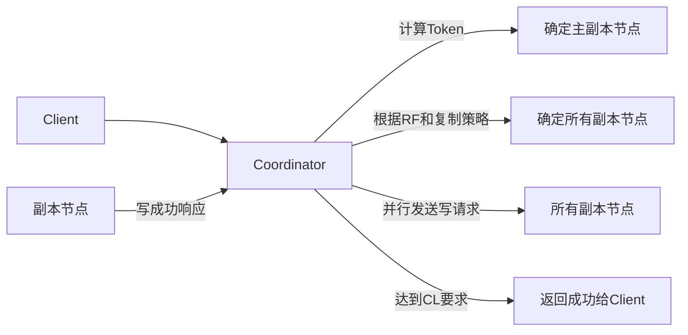
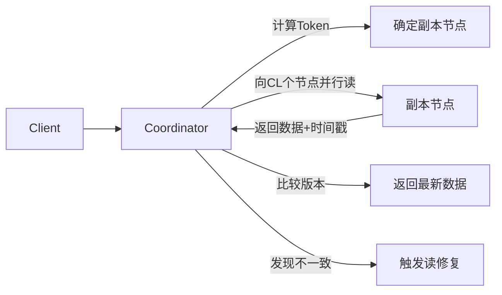

# Cassandra 架构
`Cassandra`是一个开源的、分布式的、无中心节点的、有弹性和可扩展的、高度可用的、容错的、一致和协调的、面向列的NoSQL数据库。
## 集群基本概念
### 节点(Node)
Cassandra 节点是存储数据的基础单元，本质上是一台运行着 Cassandra 软件的物理服务器或虚拟服务器。节点间采用对等（P2P）模式通信，无主从之分，每个节点地位平等。数据通过分区机制分散存储在不同节点上。
### 机架(Rack)
机架是一组物理服务器的集合，通常位于同一物理位置，机架内节点间网络延迟低，通信效率高。
### 数据中心(Datacenter)
数据中心是一组相关节点的逻辑集合，这些节点可能因地理位置、网络环境或功能需求组成一个集合。同一数据中心内的节点通常具备相似的配置或服务于特定区域的用户。例如，一个互联网公司可能在 “北京数据中心” 和 “上海数据中心” 分别部署节点，以服务不同地区的用户。
### 集群(Cluster)
由一个或多个数据中心组成的统一数据库系统，对外提供单一服务视图。


```plaintext
集群（my_cluster）
├─ 数据中心1（Beijing）
│  ├─ 机架1（机房A-1层）：node1、node2、node3
│  ├─ 机架2（机房A-2层）：node4、node5、node6
│  └─ 机架3（机房B-1层）：node7、node8、node9
└─ 数据中心2（Shanghai）
   ├─ 机架1（机房X-1层）：node10、node11、node12
   ├─ 机架2（机房X-2层）：node13、node14、node15
   └─ 机架3（机房Y-1层）：node16、node17、node18
```
## Gossip协议

### 什么是Gossip协议
对于`cassandra`这种一个由很多节点组成的分布式数据库集群，每个节点都需要知道其他节点是否存活、数据如何分布。但传统的集中式管理方式（比如有一个 “管理者” 节点）容易出现单点故障，而且难以应对大规模节点的动态变化（如节点随时加入或离开）。
`Gossip` 协议就是为了解决这个问题而生的。它模仿人类社交中的 “八卦” 行为 —— 每个节点就像一个人，定期随机选择其他节点 “聊天”，交换彼此知道的集群信息。通过这种方式，所有节点最终都能掌握整个集群的状态，不需要依赖任何中心节点它，这是一个带冗余的容错算法，属于一种最终一致性算法。虽然无法保证在某个时刻所有节点状态一致，但可以保证在”最终“所有节点一致，”最终“是一个现实中存在，但理论上无法证明的时间点。
### CAssandra的Gossip协议如何工作的
在 Cassandra 中，Gossip 协议由每个节点内的 Gossiper 类负责实现，主要做两件事：**节点状态跟踪** 和 **故障检测**。
#### 一、基础架构：每个节点信息
在Cassandra集群中，**每个节点都配备以下核心组件**：
1. **Gossiper类**  
    - 维护本地的分布式状态注册表：记录集群中所有节点的 IP、状态（在线 / 可疑 / 离线）、负载情况等信息。
    - 周期性状态扩散：通过定时任务（默认 1 秒周期）执行三轮握手协议，即触发`Gossip`会话。
    - 概率性故障检测：基于`Phi Accrual`算法实现故障判定
    ```java
    // Gossiper类的核心成员变量（简化示例）
    public class Gossiper {
        // 持有FailureDetector实例（通过构造函数注入）
        private final IFailureDetector failureDetector;
        // 本地状态表，存储EndpointState对象
        private final ConcurrentMap<InetAddress, EndpointState> stateTable;
    }
    ```
2. **EndpointState**  
记录其他节点的详细信息：
    ```json
    {
        ip: "192.168.1.1",   // 节点IP地址
        version: 12345,      // 状态版本号，每次更新递增
        load: 0.75,          // 负载情况
        dc: "us-east-1",     // 数据中心
        rack: "rack1",       // 机架信息
        status: "ALIVE",     // 状态：ALIVE（正常）/SUSPECT（怀疑）/DOWN （死亡）
        phi: 0.1             // 故障怀疑度
    }
    ```
3. **FailureDetector**  
   - 基于`Phi Accrual`算法的故障检测器
   - 维护每个节点的历史心跳记录（滑动窗口）
   - 计算并更新节点的Phi值（怀疑度）

#### 二、每秒发生了什么：Gossip的心跳周期
每秒钟，`Cassandra` 集群中的每个节点都会通过其 `Gossiper` 实例执行以下操作，实现节点间状态信息的同步：
1. **选择通信对象**  
    - 从已知节点列表中随机挑选1-3个目标节点（称为`gossip friends`）
    - 筛选规则：
        - 排除自身节点（避免自我通信）。
        - 过滤标记为DOWN的节点（基于 PHI 故障检测机制）。
        - 当集群规模 > 3 时，从剩余节点中策略优化后随机挑选 1-3 个作为`gossip friends`；若集群较小（≤3 节点），则选择所有可用节点。
    - 策略优化：
        - 优先选择最近未通信的节点或种子节点（Seed Node），确保状态信息快速扩散。
        - 采用加权随机算法，根据节点活跃度（上次通信时间、版本更新频率）动态调整选中概率。
        ```
        基础权重 = (1 + ageFactor) * (1 + versionFactor)
        ageFactor = (currentTime - lastGossipedTime) / 60000
        versionFactor = (localVersion - remoteVersion) / 1000
        种子节点额外增加50%权重
        ```
2. **发起会话（GossipDigestSynMessage）**  
   - 当前A节点从stateTable中根据策略提取部分节点的最新状态，生成轻量摘要（仅包含关键元数据），格式如下：
     ```json
        [
            {
                "endpoint": "192.168.1.1",  // 节点IP
                "generation": 1695100000,   // 节点启动时间戳（用于区分新旧节点）
                "version": 1005            // 该节点状态的版本号（每次变更时递增）
            },
            {
                "endpoint": "192.168.1.3",
                "generation": 1695100001,
                "version": 1007
            }
        ]
     ```
    - 通过 UDP 协议将摘要封装为`GossipDigestSynMessage`，发送给选中的`gossip friends`，并启动超时机制（默认 300ms）等待响应。
    - 选择策略
        - 优先选择版本号变化最大的前 50 个节点
        - 确保包含本地节点自身
        - 随机采样其他节点以增加覆盖度
3. **处理差异响应（GossipDigestAckMessage）**  
   - 接收响应解析：目标节点收到摘要后，对比本地`stateTable`，返回`GossipDigestAckMessage`，包含两部分内容：
        - 需要拉取的差异列表：本地版本号低于摘要的节点（如目标节点的192.168.1.3版本为 1007,高于本地 1004）。
        - 新增或更高版本的完整状态：如新发现的节点信息或版本更高的状态数据。
        ```json
            节点 IP	本地版本（B）	摘要版本（A）	处理逻辑
            192.168.1.1	1006	1005	B 的版本更新，需通知 A
            192.168.1.3	1004	1007	A 的版本更新，B 需拉取
        ```
    - 目标节点根据差异列表，从本地`stateTable`中提取相应节点的状态数据，封装为`GossipDigestAckMessage`，发送给发送方。
        ```json
        {
            "digests": [  // B需要从A拉取的差异
                {"endpoint": "192.168.1.3", "version": 1004}  // B的本地版本低于摘要
            ],
            "stateMap": {  // B提供给A的更高版本状态
                "192.168.1.1": {
                "version": 1006,
                "state": {"LOAD": 0.65, "STATUS": "ALIVE",...}
                }
            }
        }
        ```
4. **完成会话（GossipDigestAck2Message）**  
    - 最终确认：发送方根据`GossipDigestAckMessage`完成本地更新后，向目标节点发送`GossipDigestAck2Message`，包含：
       ```json
        {
            "stateMap": {
                "192.168.1.3": {
                "version": 1007,
                "state": {"LOAD": 0.8, "STATUS": "ALIVE",...}
                }
            }
        }
       ```
    - 一致性保障：三轮握手`（Syn → Ack → Ack2）`确保通信双方状态最终一致。即使中间某轮消息丢失，超时机制会触发重传，保证最终一致性。

#### 三、故障检测：从"心跳"到"定罪"的过程
当节点A与节点B通信时，**故障检测的详细流程**：
1. 正常心跳：基于概率的健康监测
    - 节点 A 向随机节点 B 发送`GossipDigestSynMessage`。
    - 节点 B 收到后返回 `GossipDigestAckMessage`，节点 A 记录 RTT（如 100ms）。
    - 节点 A 计算PHI，正常情况下接近0，代表节点正常
    - `FailureDetector` 维护节点 B 的 RTT 样本队列（如最近 100 次通信的 RTT），拟合为高斯分布（均值 μ，标准差 σ）。`PHI = -log₁₀(1 - CDF(RTT)) `,CDF为累积分布函数。
2. 怀疑阶段：单次失败即触发概率升级
    - 节点 A 发送 `Gossip` 消息后超时（默认 300ms 未收到响应），视为一次失败。
    - PHI 值增长：根据失败时的 RTT 异常程度计算，例如：若预期 RTT 均值 μ=100ms，超时对应 RTT=∞，则CDF(∞)=1，1 - CDF=0，PHI=-log₁₀(0)→趋近于 +∞。实际中，`FailureDetector` 会用指数退避算法平滑增长 PHI（如每次失败增加 0.5~2.0）。
    - 当 PHI 值持续超过预警阈值（默认 10.0）时，节点 B 被标记为SUSPECT（可疑）。
    - 此时 A 节点增加与节点 B 的通信频率（如从每秒 1 次→每秒 5 次），快速验证状态。
    - 通过 `Gossip` 向其他节点传播 "SUSPECT" 状态，但不触发数据修复。
3. 定罪阶段：基于概率阈值的最终判定
    - 当 PHI 值持续超过定罪阈值（默认 16.0）时，节点 A 判定节点 B 为DOWN。物理意义：PHI=16.0表示 "节点正常通信的概率`≤10⁻¹⁶`"，接近不可能事件。
    - 本地标记：节点 A 在`stateTable`中标记节点 B 为DOWN，记录时间戳。
    - 状态扩散：节点 A 在下一轮 `Gossip` 中，将节点 B 的 DOWN 状态包含在发送给 1-3 个随机节点的摘要中。这些节点再将该状态转发给各自的 1-3 个邻居，经过多轮扩散（每轮约 1 秒），最终所有节点都会收到该状态。
4. 数据冗余保障：
    - Hinted Handoff：本应由节点 B 处理的写请求，临时存储在其他节点（如相邻机架的节点 C），等待节点 B 恢复后回放。
    - 副本重新分配：协调器节点（如拥有令牌范围的主节点）检测到节点 B DOWN，触发虚拟节点（VNode）副本重平衡，确保副本数符合复制策略（如 RF=3 时，从其他节点复制数据到新节点）。
    - 故障隔离：查询路由时自动跳过 DOWN 节点，读写请求仅分配给 ALIVE 节点。

#### 四、常见场景示例
##### 新节点加入
1. 节点 C 启动并连接到种子节点
2. 节点 C 读取配置文件中的seed_provider，向种子节点（如节点 A）发送加入请求。
3. 种子节点验证节点 C 的令牌范围和集群版本，将其纳入 `Gossip` 环。
4. 通过 `Gossip` 逐步扩散信息：种子节点 A 在下一轮 `Gossip` 中，将节点 C 的信息（IP、generation、初始版本号）包含在发送给 1-3 个随机节点的摘要中。
- 扩散时间线:
    -   1 秒内：约 30% 的节点通过 1-2 轮 `Gossip` 得知节点 C（基于 O (log n) 传播模型）。
    -   3 秒内：几乎所有节点（>99%）收到信息，节点 C 被标记为`ALIVE`。
- 数据同步:协调器节点触发流式传输（Stream）：将节点 C 负责的令牌范围数据从现有副本复制到节点 C。同步完成后，节点 C 正式参与读写服务。
##### 网络波动
1. 网络暂时中断
    - 节点 A 与节点 B 之间的网络中断，节点 A 连续 3 次发送 Gossip 消息超时。
    - PHI 值上升:单次超时导致 PHI 值非线性增长：
        - plaintext
        - T=0s: PHI=0.3（正常）  
        - T=1s: 超时，PHI=0.3+2=2.3  
        - T=2s: 超时，PHI=2.3+3=5.3  
        - T=3s: 超时，PHI=5.3+4=9.3（超过预警阈值10.0）  
    - 状态标记为 SUSPECT
    - 当 PHI≥10.0 时，节点 A 将节点 B 标记为SUSPECT，并通过 Gossip 传播该状态。
2. 网络恢复处理
    - 若 3 秒内恢复：
        - 节点 A 成功与节点 B 通信，RTT 恢复正常（如 100ms），PHI 值骤降至 0.3。
        - 节点 A 通过 Gossip 传播节点 B 的ALIVE状态，覆盖之前的 SUSPECT 标记。
    - 若中断持续 10 秒：
        - PHI 值持续上升，超过定罪阈值 16.0，节点 B 被标记为DOWN。
##### 节点永久故障
1. 节点 B 硬件故障,节点 B 完全不可用，无法响应任何 Gossip 消息。
2. PHI 值持续上升
    - 其他节点（如 A、C、D）对节点 B 的 PHI 值每 300ms 增加约 2.0：
    - plaintext
        - T=0s: PHI=0.3  
        - T=3s: PHI=0.3+10≈10.3（标记为SUSPECT）  
        - T=8s: PHI≈16.3（超过定罪阈值16.0，标记为DOWN）  
3. 状态扩散与集群响应
    - 约 8 秒后：所有节点通过 Gossip 达成共识，将节点 B 标记为DOWN。
    - Hinted Handoff 启动：
    - 原本路由到节点 B 的写请求，被临时存储在其他节点（如节点 A、C）的 Hint 仓库中。
4. 副本重新分配：
    - 协调器节点计算新的副本分布（如将节点 B 的令牌范围数据复制到节点 D、E）。
    - 通过 ** 反熵修复（Anti-Entropy）** 确保数据一致性。
5. 节点 B 恢复后的处理
    - 若节点 B 修复后重启：
    - 重新加入集群，通过 Gossip 宣告自己ALIVE。
    - 其他节点将 Hinted Handoff 中缓存的写请求回放给节点 B。
## 令牌环（Rings and Tokens）

### 基本结构
1. 逻辑环形空间
    - 令牌环是一个虚拟的环形空间，由所有可能的令牌值（Token）组成。
    - 令牌值的范围取决于分区器（Partitioner）：
        - Murmur3Partitioner：64 位长整型，范围为[-2^63, 2^63-1]。
        - ByteOrderedPartitioner：按字节序排列，无固定范围。
2. 节点与数据的映射
    - 每个物理节点通过 `虚拟节点（VNode）`占据环上的多个位置（令牌值）。
    - 数据的分区键（Partition Key）经分区器计算后生成一个令牌值，该值在环上的位置决定了数据应存储的节点。
## 虚拟节点（VNode）
虚拟节点是实现数据均匀分布和动态扩缩容的核心机制。它通过将物理节点抽象为多个逻辑分片，解决了传统分布式系统中数据倾斜和扩缩容复杂性的问题。
### 传统分布式节点和虚拟节点对比
1. 传统分布式系统问题：
    - 每个物理节点直接负责一段连续的令牌范围（如节点 A 负责 Token 1-100），导致：
        - 数据倾斜：若热点数据集中在某个令牌区间，对应节点会成为性能瓶颈。
        - 扩缩容复杂：新增节点需迁移整个区间的数据，耗时且影响服务。
2. 虚拟节点的解决方案：
    - 将物理节点拆分为多个 VNode，每个 VNode 随机分布在令牌环上，实现：
        - 数据均匀分布：即使存在热点分区键，其影响也会被分散到多个物理节点。
        - 高效扩缩容：新增节点只需从现有节点 “窃取” 部分 VNode，而非整个区间。
### 工作机制
1. 令牌环的分布
VNode 在令牌环上随机分布，而非连续区间，实际生产环境中，每个节点默认有 256 个 VNode，分布更均匀。
```plaintext
物理节点 Node1 → VNode1(Token=100), VNode2(Token=500)  
物理节点 Node2 → VNode3(Token=300), VNode4(Token=700)  
物理节点 Node3 → VNode5(Token=600), VNode6(Token=900)
```
2. 数据路由流程
```plaintext
分区键 → 分区器计算令牌 → 查找令牌环上的下一个 VNode → 对应物理节点
```
比如分区键 `user_id=123` 生成令牌 `Token=200`，该令牌落在 `VNode3` 的区间`Token=300`，因此数据存储到 `Node2`。
### 虚拟节点的优势
1. 数据均匀分布
    - 每个物理节点负责多个 VNode，数据均匀分布在环上。
    - 即使存在热点分区键，其影响也会被分散到多个物理节点。
    - 若用户 user_id=1 的访问量远超其他用户，其数据会被分散到多个 VNode，避免单节点过载。
2. 高效扩缩容
    - 新增节点，从现有节点窃取部分VNode，仅需迁移这些VNode对应的数据。
    ```plaintext
        原集群：Node1(128VNodes), Node2(128VNodes)
        新增Node3 → 系统自动分配128VNodes，从Node1和Node2各窃取64个VNode

        迁移前数据分布：
        Node1: 负责VNode1-128 (Token范围覆盖约50%)
        Node2: 负责VNode129-256 (Token范围覆盖约50%)

        迁移后数据分布：
        Node1: 保留VNode1-64 (Token范围约25%)
        Node2: 保留VNode193-256 (Token范围约25%)
        Node3: 获得VNode65-192 (Token范围约50%)
    ```
    - 节点下线
    ```plaintext
        原集群：Node1(128VNodes), Node2(128VNodes), Node3(128VNodes)
        Node2下线 → 将其VNode129-256迁移至Node1和Node3

        迁移后数据分布：
        Node1: 新增VNode129-192 (总Token范围约37.5%)
        Node3: 新增VNode193-256 (总Token范围约37.5%)
    ```
## 分区器（Partitioners）
在`cassandra`中，分区器是决定数据如何分布到集群各个节点的一个核心组件。它通过对数据的分区键`Partition Key`进行哈希计算，将数据映射到不同的 `Token` 范围，从而实现数据的均匀分布和可扩展存储。
### 核心作用
分区器本质上是一个哈希算法，而是将分区键（Partition Key）映射为一个令牌（Token）。这个令牌用于确定数据在分布式集群中的存储位置。
1. 输入：分区键
2. 处理：分区器通过特定的算法如 Murmur3、旧式的 MD5 等）对分区键进行计算，生成一个固定长度的令牌值（例如 Murmur3Partitioner 生成 64 位的长整型令牌）。
3. 输出：令牌值，用于确定数据属于哪个虚拟节点的管理范围。
## 复制策略
在分布式系统中，复制（Replication）是保障数据可用性和容错性的核心机制。Cassandra 通过灵活的复制策略，在多节点集群中存储数据副本，并提供可调的一致性级别。
### 复制因子
1. 基本概念
    - 复制因子（Replication Factor）：指每个数据分区在集群中存储的物理节点副本数量（RF ≥ 1）。
    - 每个副本存储在不同的物理节点上，确保部分节点故障时数据仍可访问。例如，RF=3 表示数据会在 3 个不同物理节点上各存储一份。
    - 复制因子与虚拟节点（VNode）无关。VNode 是数据分布的机制，而复制因子直接作用于物理节点的副本数量。
2. 配置方式
    ```cassandra
    -- 创建Keyspace时指定复制因子
    CREATE KEYSPACE my_keyspace 
    WITH REPLICATION = {
    'class': 'NetworkTopologyStrategy', 
    'DC1': 3,  // DC1 内保留3个物理节点副本
    'DC2': 2   // DC2 内保留2个物理节点副本
    };
    ```
### 复制策略分类
1. 简单复制策略（SimpleStrategy）
    - 主副本存储在数据令牌对应的节点。
    - 后续副本按令牌顺时针依次存储在后续节点。
    ```
        比如RF=3
        数据令牌 → 物理节点A（主副本） → 物理节点B（副本1） → 物理节点C（副本2）
    ```
2. 网络拓扑感知复制策略（NetworkTopologyStrategy）
    - 主副本存储在数据令牌对应的物理节点。
    - 本地副本：在主副本所在 DC 内，按令牌环顺时针选择后续物理节点，直到满足该 DC 的 RF
    - 跨 DC 副本：在其他 DC 内按 ** 机架（Rack）** 分散选择物理节点，避免同一 Rack 故障导致多副本丢失。
    ```
    若主副本在 DC1 的物理节点 A（Rack1），则：
    DC1 内副本：物理节点 A → 物理节点 B（Rack2） → 物理节点 C（Rack3）。
    DC2 内副本：物理节点 D（Rack1） → 物理节点 E（Rack2） → 物理节点 F（Rack3）。
    ```
### 副本放置算法（针对NetworkTopologyStrategy）
1. 主副本选择
数据令牌对应的物理节点作为主副本，无论该节点位于哪个 DC。
2. 本地副本
    - 本地 DC 内，按令牌环顺时针选择后续物理节点，直到满足该 DC 的 RF。
    - 机架感知（Rack Awareness）：通过 cassandra-rackdc.properties 配置节点的 Rack 信息，确保副本分散在不同 Rack 上。
3. 跨 DC 副本
    - 在其他 DC 内按节点的 Rack 信息分散选择物理节点。
    - 机架感知（Rack Awareness）：通过 cassandra-rackdc.properties 配置节点的 Rack 信息，确保副本分散在不同 Rack 上。
### 一致性协同
1. 常见一致性级别
    - ONE：只需要一个节点响应。
    - QUORUM：至少需要 Quorum=RF/2 +1 个节点响应。
    - ALL：需要所有节点响应。
2. 跨 DC 一致性
    - EACH_QUORUM：每个 DC 至少需要 Quorum 个节点响应。
    - LOCAL_QUORUM：本地 DC 至少需要 Quorum 个节点响应。
3. 示例（RF=3, CL=QUORUM）
    - 写操作需等待 2 个物理节点确认（3/2 + 1 = 2）。
    - 读操作需从 2 个物理节点读取并比较版本，返回最新值。
## 一致性水平（Consistency Levels）
在分布式系统中，一致性是指多个副本之间的数据同步程度。Cassandra 提供了灵活的一致性级别配置，允许用户在可用性和数据一致性之间权衡，以满足不同业务场景的需求。
### CAP 定理与最终一致性
1. CAP 定理
    - 在分布式系统中，无法同时满足一致性（Consistency）、可用性（Availability）和分区容错性（Partition Tolerance），必须选择其中两个。
    - Cassandra 选择了 AP（可用性 + 分区容错性），并通过可调的一致性级别提供弱一致性到强一致性的灵活选择。
2. 最终一致性
    - 默认情况下，Cassandra 提供最终一致性：写操作完成后，副本之间可能存在短暂不一致，但最终会达成一致。
### 读写一致性级别
1. 写一致性级别
```plaintext
级别	描述
ANY	只要有一个节点接收写请求（即使数据只写入 Hint），写操作即成功。
ONE	至少有一个物理节点成功写入数据，写操作即成功。
TWO	至少有两个物理节点成功写入数据。
THREE	至少有三个物理节点成功写入数据。
QUORUM	成功写入的物理节点数达到 QUORUM = RF/2 + 1。
ALL	必须所有物理节点都成功写入数据，写操作才成功。
```
2. 读一致性级别
```plaintext
ONE	从任意一个物理节点读取数据，返回最快响应的数据（可能是旧版本）。
TWO	从至少两个物理节点读取数据，并返回最新版本。
THREE	从至少三个物理节点读取数据，并返回最新版本。
QUORUM	从至少 QUORUM 个物理节点读取数据，比较版本后返回最新值。
ALL	从所有物理节点读取数据，返回最新值（若有不一致，自动触发修复）。
LOCAL_ONE	只从本地数据中心的任意节点读取。
LOCAL_QUORUM	本地数据中心内达到 QUORUM。
EACH_QUORUM	每个数据中心内都达到 QUORUM（跨 DC 强一致性）。
```
### 一致性级别与复制因子的关系
1. QUORUM 计算示例
    - 当 RF=3 时，QUORUM = 3/2 + 1 = 2。
    - 当 RF=5 时，QUORUM = 5/2 + 1 = 3。
2. 读写一致性的协同
    - 为保证强一致性，需满足：Read CL + Write CL > RF。
    - 例如：RF=3，Write CL=QUORUM (2) + Read CL=QUORUM (2) = 4 > 3，确保读写操作有重叠节点。
## 协调者（Coordinator）
协调者（Coordinator） 是处理客户端请求的核心组件，负责调度数据的读写操作、协调副本同步以及保证一致性。
### 协调者的概念
1. 定义：
    - 协调者是客户端请求的入口节点，负责接收请求、路由数据并返回结果。
    - 每个请求都会随机选择一个节点作为协调者
2. 无中心化架构
    - Cassandra 是无中心化的分布式系统，每个节点都可以作为协调者，不存在单点故障。
    - 客户端可以连接任意节点发送请求，无需关心数据的实际存储位置。
### 协调者的工作流程
1. 写操作流程


- Token 计算：协调者通过分区器计算分区键的 Token 值。
- 副本定位：根据复制策略（如 NetworkTopologyStrategy）确定所有副本节点。    
- 并行写入：协调者并行向所有副本节点发送写请求。
- 响应收集：等待至少 CL 个节点确认写入成功后，返回结果给客户端
2. 读操作流程

- Token 计算：同写操作，确定数据所在的副本节点。
- 副本定位：确定至少 CL 个副本节点。
- 并行读取：向至少 CL 个节点发送读请求。
- 版本比较：比较各副本返回的数据时间戳，返回最新版本。
- 读修复：若发现副本不一致，协调者会自动触发修复（向旧副本写入新版本）。
### 协调者的职责
1. 数据路由
    - 通过分区器将分区键映射到具体的 Token 和 VNode，从而定位数据所在的物理节点。
2. 一致性保证
    - 确保读写操作满足指定的一致性级别（CL），例如：
    - 当 CL=QUORUM 时，协调者需等待至少 RF/2 + 1 个节点响应。
3. 故障处理
    - 若某个副本节点不可用，协调者会：
    - 写操作：将数据写入其他节点并记录 Hint（Hinted Handoff）。
    - 读操作：从可用节点读取数据，忽略不可用节点。
4. 读修复触发
    - 当使用 CL=QUORUM 或更高级别时，协调者会比较多个副本的数据版本，自动修复不一致的副本。
## 故障处理
在分布式系统中，故障处理是保障高可用性的核心能力。Cassandra 通过多种机制确保节点故障、网络分区等异常场景下数据的可用性和一致性。
### 核心故障处理机制
1. 暗示切换 （Hinted Handoff）
场景：当执行写操作时，如果目标副本节点处于不可用状态。
    - 协调者会把写请求转发至其他可用节点，同时记录 Hint（其中包含目标节点的相关信息）。
    - Hint 会被存储在协调者本地（默认的存储路径是 /var/lib/cassandra/hints），其有效期为 3 小时。
    - 待目标节点恢复正常后，协调者会推送 Hint 来完成数据同步工作。
2. 读修复（Read Repair）
场景：当执行读操作时，发现多个副本之间的数据不一致。
    - 协调者会向多个副本发起数据读取请求（读取的副本数量由 CL 决定）。
    - 对各副本数据的时间戳进行比较，返回时间戳最新的版本。
    - 以异步方式将最新版本写回到持有旧版本的副本节点。
3. 反熵修复（Anti-Entropy Repair）
场景：需要定期检查并修复副本之间存在的比如网络分区等导致的不一致情况。
    - Merkle Tree（默克尔树）
        - 叶子节点：数据分区(partition)和哈希值。
        - 非叶子节点：存储子节点哈希的哈希值。
        - 根节点：存储整个树的哈希值。
    - 比较过程
        - 两个节点交换根哈希值，若相同则数据一致。
        - 若不同，递归比较子树，直到定位到不一致的叶子节点（数据分区）。
    - 关键步骤
        - 节点A和节点B各自为表生成树，每个叶子节点对应一个数据分区的哈希值。
        - 节点A和节点B交换根哈希值，若相同则数据一致。
        - 若不同，节点A和节点B分别为表生成树，递归比较子树，直到定位到不一致的叶子节点。
        - 传输差异数据，进传输分区不同的数据，而非整张表。
        - 应用修复，时间戳旧的节点B用节点A的差异数据覆盖自己的旧数据
## 综合例子

### 集群环境假设
集群名称：my_cluster
数据中心：
- 北京（DC1）：3 个机架，共 9 个节点（node1~node9），复制因子RF=3
- 上海（DC2）：3 个机架，共 9 个节点（node10~node18），复制因子RF=2
- 复制策略：NetworkTopologyStrategy（机架感知）
- 分区器：Murmur3Partitioner（64 位令牌环）
- 虚拟节点：每个物理节点默认 256 个 VNode

### 客户端请求：步骤 1：客户端发起写请求
写入数据user_id=123，username=Alice，一致性级别CL=QUORUM
客户端连接到任意节点（如node1），发送写请求：
```cql
INSERT INTO users (user_id, username) VALUES (123, 'Alice');
```
### 步骤 2：协调者定位数据分区
- 计算令牌：分区键user_id=123经Murmur3Partitioner计算，生成令牌Token=0x123456。
- 定位主副本：令牌环中，Token=0x123456的下一个 VNode 属于node4（DC1 - 机架 2），因此node4为主副本。
- 确定所有副本节点（根据复制策略）：
    DC1 内副本（RF=3）：
    - 主副本：node4（机架 2）
    - 顺时针下一个节点：node7（DC1 - 机架 3）
    - 再下一个节点：node2（DC1 - 机架 1，跳过同机架节点以分散副本）
    DC2 内副本（RF=2）：
    - 随机选择机架分散的节点：node11（DC2 - 机架 1）、node14（DC2 - 机架 2）
- 最终副本列表：node4, node7, node2, node11, node14
### 步骤 3：Gossip 协议同步节点状态
- 在写操作前，node1通过 Gossip 协议确认所有副本节点状态：
- node4、node7、node2状态为ALIVE（DC1 内通信延迟低）。
- node11、node14通过跨数据中心 Gossip 确认状态为ALIVE（每秒与 DC2 节点通信 1 次）。
### 步骤 4：协调者执行写操作
- 并行写入副本：
- node1向 5 个副本节点并行发送写请求，携带数据和时间戳（timestamp=1695100000）。
- 等待响应（CL=QUORUM）：DC1 的 QUORUM 为3/2+1=2，DC2 的 QUORUM 为2/2+1=2。
- 因CL=QUORUM跨 DC 时需满足EACH_QUORUM（隐含要求每个 DC 至少 QUORUM 响应），但本例中CL=QUORUM默认仅针对本地 DC（假设客户端指定LOCAL_QUORUM），则只需 DC1 的 2 个节点 + DC2 的 1 个节点响应（总 3 个，满足QUORUM=5/2+1=3）。
- 成功响应节点：node4、node7（DC1）和node11（DC2）确认写入成功，达到 CL 要求。
- 协调者返回成功给客户端。
### 步骤 5：模拟故障：node7 宕机
- Gossip 检测故障：
- node1连续 3 次向node7发送 Gossip 消息超时，PHI 值从0.3升至10.3，标记为SUSPECT。
- 第 8 秒时 PHI>16.0，判定node7为DOWN，并通过 Gossip 扩散状态。
- Hinted Handoff 触发：
- 新写请求若涉及node7作为副本，协调者（如node4）会将数据暂存到同机架的node5（DC1 - 机架 2），记录 Hint：{target=node7, data=...}。
- Hint 存储路径：/var/lib/cassandra/hints/node7-hint-20250522.dat，有效期 3 小时。
### 步骤 6：读操作与读修复
- 客户端读取数据：SELECT * FROM users WHERE user_id=123，协调者为node2（DC1）。
- 定位副本节点：node4（主副本）、node2、node11（DC2）。
- 并行读取：
    - node4返回数据（timestamp=1695100000）。
    - node2返回旧数据（假设因网络延迟未及时同步，timestamp=1695100000，实际应一致，此处模拟异常）。
    - node11返回数据（timestamp=1695100000）。
    - 版本比较：所有副本时间戳一致，无不一致，直接返回数据。
    - 若发现不一致（如node2时间戳为1695100000，node4为1695100001），协调者会异步向node2写入最新版本（读修复）。
### 步骤 7：反熵修复（定期任务）
- 节点node1与node4执行反熵修复：
    - 生成 Merkle 树，比较根哈希值，发现users表分区Token=0x123456的哈希不一致。
    - 递归比较子树，定位到具体分区，传输差异数据（如user_id=123的最新版本）。
    - node4将最新数据同步到node2，确保副本一致。
### 步骤 8：node7 恢复上线
- Gossip 检测恢复：node7启动后连接种子节点，通过 Gossip 宣告ALIVE，状态扩散至全集群。
- Hint 回放：node5将暂存的 Hint 数据推送给node7，完成数据同步。
- 虚拟节点重平衡：集群自动从其他节点（如node5、node8）迁移部分 VNode 到node7，恢复负载均衡。
